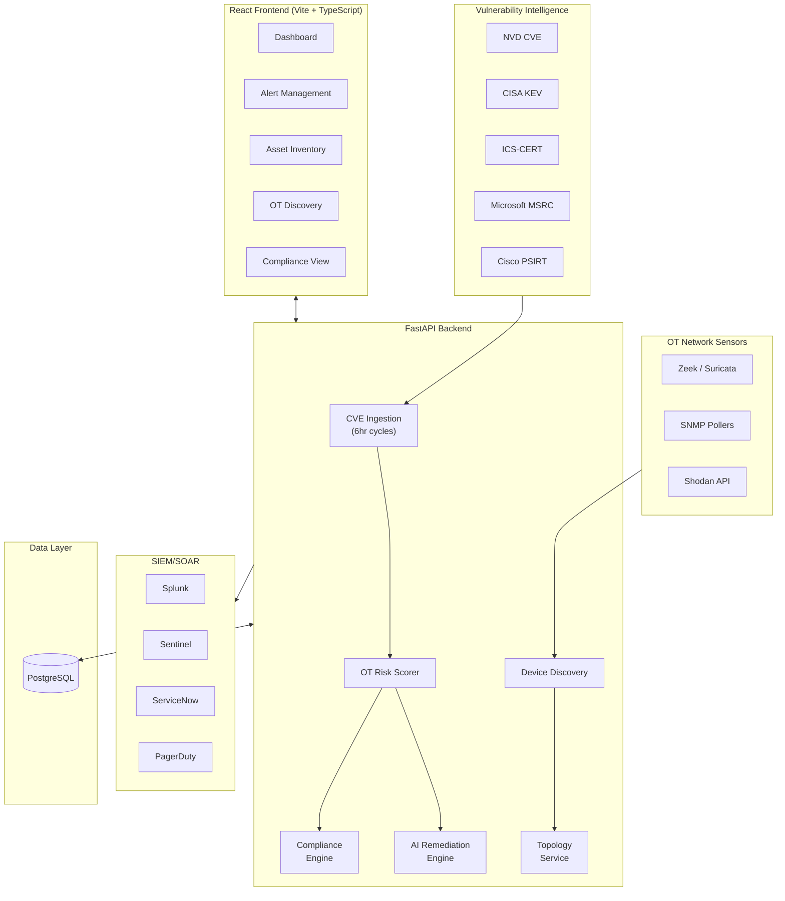

# OneAlert 2.0 — Industrial OT/ICS Cybersecurity Platform

[](https://github.com/mangod12/OneAlert/actions/workflows/ci.yml)
[](https://cybersec-saas-ebqzvaqu6a-uc.a.run.app/app/)
[]()
[](LICENSE)

**The affordable, self-service OT vulnerability management platform** — AI-powered remediation, continuous compliance monitoring, and SBOM analysis for SMB manufacturers at 1/50th the cost of enterprise alternatives (Claroty, Dragos, Nozomi).

## Live Demo

**https://cybersec-saas-ebqzvaqu6a-uc.a.run.app/app/**

| | |
|---|---|
| Email | `admin@example.com` |
| Password | `password123` |

> Pre-loaded with a realistic water treatment plant environment: 11 OT/IT assets, 6 real CVE alerts, 4 discovered devices, network topology, and compliance frameworks.

---

## What Makes This Different

| Dimension | Enterprise Incumbents | OneAlert |
|-----------|----------------------|----------|
| **Price** | $300K–$800K/yr | $499–$4,999/mo |
| **Deployment** | Hardware sensors + pro services (weeks) | Self-service SaaS (minutes) |
| **SBOM** | None native | Built-in CycloneDX/SPDX parsing |
| **Compliance** | Static PDF reports | Continuous automated evidence collection |
| **Remediation** | Detection only | AI-powered OT-aware remediation guidance |
| **Time to Value** | 3–6 months | Same day |

---

## Platform Capabilities

### Security & Vulnerability Management
- Multi-source CVE aggregation (NVD, CISA KEV, ICS-CERT, Cisco PSIRT, Microsoft MSRC, Red Hat)
- AI-powered remediation engine with 5 OT-aware rules (patch vs. compensating control based on Purdue zone)
- EPSS exploit probability scoring (FIRST.org API)
- CISA KEV active exploitation flagging
- Alert deduplication, acknowledgment workflow, and audit trail

### OT/ICS Asset Discovery
- Passive device discovery via network sensors (Zeek, Suricata, SNMP, Shodan)
- Industrial protocol detection (Modbus, DNP3, PROFINET, EtherNet/IP, OPC-UA, HART)
- Purdue model zone classification (Level 0–5)
- Device-to-asset correlation and promotion workflow
- Network topology mapping with graph visualization

### Compliance-as-Code
- IEC 62443-3-3 (10 controls) + NIST CSF 2.0 (11 controls) pre-loaded
- Automated evidence collection from platform data
- Continuous compliance scoring per framework
- Manual assessment override with evidence documentation

### SBOM & Software Composition Analysis
- CycloneDX and SPDX JSON ingestion
- Component extraction (name, version, supplier, PURL, CPE, license, hash)
- Vulnerability cross-reference against tracked CVEs

### SIEM/SOAR Integrations
- Splunk HTTP Event Collector
- Microsoft Sentinel (Log Analytics API)
- ServiceNow incident creation
- PagerDuty event triggering
- Per-user configuration with test-connection validation

### Billing & Multi-Tenancy
- Organization model with role-based access (admin/analyst/viewer)
- Stripe billing integration (checkout, webhooks, plan gating)
- Plan tiers: Free (10 assets) → Starter ($499) → Pro ($1,999) → Enterprise ($4,999)
- Feature gating and usage enforcement per plan

---

## Architecture



---

## Tech Stack

| Layer | Technology |
|-------|-----------|
| **Backend** | Python 3.11, FastAPI, SQLAlchemy 2.0, Alembic, APScheduler |
| **Frontend** | React 18, TypeScript, Vite, Tailwind CSS v4, Zustand, Recharts |
| **Database** | PostgreSQL 16 (Cloud SQL), SQLite (dev) |
| **Auth** | JWT + GitHub OAuth + TOTP MFA |
| **Infra** | Docker (multi-stage), Google Cloud Run, Cloud Build |
| **CI/CD** | GitHub Actions (test) + Cloud Build (deploy) |
| **Observability** | structlog, request metrics middleware, health probes |
| **Tests** | pytest (166 tests), pytest-asyncio, pytest-cov |

---

## Quick Start

### Local Development

```bash
# Clone and install
git clone https://github.com/mangod12/OneAlert.git
cd OneAlert
pip install -r requirements.txt

# Start both frontend + backend (parallel dev servers)
./dev.sh

# Or backend only
uvicorn backend.main:app --reload --port 8000
```

Visit: http://localhost:8000/app/

### Docker

```bash
docker compose up --build
# App: http://localhost:8000/app/
# PostgreSQL: localhost:5432
```

### Production (Cloud Run)

Push to `main` triggers Cloud Build → deploys to Cloud Run automatically.

```bash
# Manual deploy
gcloud builds submit --config=cloudbuild.yaml --substitutions=COMMIT_SHA=$(git rev-parse HEAD)
```

---

## Configuration

| Variable | Required | Description |
|----------|----------|-------------|
| `SECRET_KEY` | Yes | JWT signing key (32+ chars) |
| `DATABASE_URL` | Yes | PostgreSQL connection string |
| `GITHUB_CLIENT_ID` | No | GitHub OAuth app ID |
| `GITHUB_CLIENT_SECRET` | No | GitHub OAuth secret |
| `STRIPE_SECRET_KEY` | No | Stripe billing integration |
| `MAILGUN_API_KEY` | No | Email alert delivery |
| `NVD_API_KEY` | No | Higher NVD rate limits |

---

## Repository Structure

```
backend/
  routers/          API endpoints (auth, assets, alerts, OT, compliance, sbom, topology, billing, integrations)
  services/         Business logic (remediation engine, EPSS, compliance, SBOM parser, billing, integrations)
  models/           SQLAlchemy models (user, asset, alert, org, remediation, compliance, sbom, topology, subscription)
  middleware/       Rate limiting, security headers, request ID, metrics
  database/         DB connection, seeding
  scheduler/        APScheduler cron jobs (CVE scraping, OT rescoring)
frontend-v2/
  src/pages/        React pages (Dashboard, Alerts, Assets, OT, Settings, AuditLog)
  src/components/   Reusable components (charts, layout, modals)
  src/stores/       Zustand state management
  src/api/          Axios client + TypeScript types
alembic/            Database migrations
tests/              166 pytest tests
docker-compose.yml  Full stack (app + PostgreSQL)
cloudbuild.yaml     Cloud Build deploy pipeline
Dockerfile          Multi-stage (Node build + Python runtime)
```

---

## Testing

```bash
# Run all 166 tests
pytest -q

# With coverage
pytest --cov=backend --cov-report=term-missing
```

---

## Roadmap (Completed)

- [x] Phase 1: Security Hardening (rate limiting, MFA, security headers, Alembic)
- [x] Phase 2: Modern React Frontend (Vite + TypeScript + Tailwind)
- [x] Phase 3: Multi-Tenancy & Organizations
- [x] Phase 4: AI Remediation Engine + EPSS
- [x] Phase 5: Compliance-as-Code (IEC 62443, NIST CSF)
- [x] Phase 6: SBOM & Software Composition Analysis
- [x] Phase 7: Network Topology Mapping
- [x] Phase 8: Stripe Billing & Subscriptions
- [x] Phase 9: SIEM/SOAR Integrations (Splunk, Sentinel, ServiceNow, PagerDuty)
- [x] Phase 10: Observability (structured logging, metrics, health probes)

### Next Up
- NERC CIP / NIS2 compliance framework expansion
- Real-time WebSocket alerts
- Network topology interactive visualization (React Flow)
- SAML/SSO for enterprise customers
- Anomaly detection for OT protocol traffic

---

## Author

**Anshaj Kumar**
Backend & Security Engineer — Industrial Systems | Cloud-Native Architectures

---

## License

MIT
