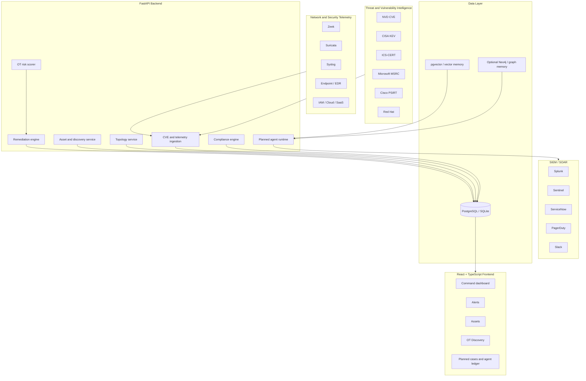

# OneAlert

[](https://github.com/mangod12/OneAlert/actions/workflows/ci.yml)
[](https://cybersec-saas-ebqzvaqu6a-uc.a.run.app/app/)
[](LICENSE)

**OneAlert is an open, self-hostable OT/ICS security platform evolving into a governed AI security agent for asset protection, network telemetry, vulnerability intelligence, compliance evidence, and authorized purple-team validation.**

It is built for SMB manufacturers, utilities, and industrial operators that need serious security visibility without the cost and deployment weight of enterprise OT platforms.

Live demo: https://cybersec-saas-ebqzvaqu6a-uc.a.run.app/app/

| Demo account | Value |
| --- | --- |
| Email | `admin@example.com` |
| Password | `password123` |

The demo is seeded with a water-treatment environment: OT/IT assets, real CVE-style alerts, discovered devices, network topology data, compliance controls, and integrations.

## Why This Project Matters

Most security tools stop at one of three layers:

- Vulnerability scanners show CVEs but miss process risk.
- SIEMs collect logs but require expensive rules and analysts.
- AI SOC products promise automation but are often closed-source, cloud-bound, and hard to audit.

OneAlert is designed to combine the useful parts:

- **OT-aware asset graph:** assets, firmware, protocols, Purdue zones, topology, SBOMs, and CVEs.
- **Security telemetry foundation:** Zeek, Suricata, syslog, endpoint, cloud, IAM, and SIEM events.
- **Governed AI agents:** detect, triage, hunt, respond, report, and purple-team validation with full run ledgers.
- **Open model support:** Ollama, vLLM, LM Studio, llama.cpp, and OpenAI-compatible local endpoints.
- **Authorization-first offensive validation:** scoped, sandboxed, dry-run by default, and approval-gated.

## Current Capabilities

### OT/ICS Vulnerability Management

- CVE and advisory ingestion from NVD, CISA KEV, ICS-CERT, Cisco PSIRT, Microsoft MSRC, Red Hat, and vendor feeds.
- EPSS exploit probability enrichment.
- Alert deduplication, acknowledgment workflow, and audit trail.
- OT-aware remediation rules that account for asset criticality and Purdue-style zones.

### Asset, Discovery, and Topology

- Managed asset inventory with vendor, product, firmware, CPE, criticality, OT flag, network zone, and protocol.
- Discovered device ingestion for sensors such as Zeek, Suricata, SNMP pollers, Shodan, and custom collectors.
- Industrial protocol awareness for Modbus, DNP3, PROFINET, EtherNet/IP, OPC-UA, HART, and related OT traffic.
- Network connection storage and graph-ready topology service.

### Compliance and SBOM

- Compliance-as-code for IEC 62443 and NIST CSF.
- Automated evidence collection from platform data.
- CycloneDX and SPDX JSON SBOM ingestion.
- Component extraction with PURL, CPE, supplier, license, and hash fields.

### Integrations and Operations

- Splunk HTTP Event Collector.
- Microsoft Sentinel Log Analytics API.
- ServiceNow incident creation.
- PagerDuty event triggering.
- Slack, webhook, and SIEM alert senders.
- Multi-tenant organizations, RBAC, Stripe plan gating, health probes, metrics middleware, and structured logging.

## AI Agent Roadmap

The next product step is an agentic security layer on top of the existing platform. The full plan is in [docs/AI_SECURITY_AGENT_ROADMAP.md](docs/AI_SECURITY_AGENT_ROADMAP.md).

| Phase | Goal | Outcome |
| --- | --- | --- |
| 0 | Safety and positioning | Scope, policy, approval, and audit contract for agent actions |
| 1 | Telemetry foundation | Normalized Zeek, Suricata, syslog, endpoint, IAM, and cloud events |
| 2 | Agent runtime | Local model provider abstraction, run ledger, tool-call history |
| 3 | AI triage and cases | Incident cases with evidence, blast radius, and MITRE mapping |
| 4 | Hunt and detection engineering | Natural-language hunts plus Sigma, KQL, SPL, Suricata, Snort, and YARA drafts |
| 5 | Response planning | Dry-run containment plans, approvals, rollback steps, ChatOps |
| 6 | Purple-team validation | Caldera/OpenBAS/Atomic/Nmap/nuclei adapters under strict authorization |
| 7 | Security graph memory | Similar incident retrieval, attack paths, entity risk, and remediation history |
| 8 | Recruiter-grade demo | One-command demo, screenshots, benchmark data, and case replay |

## Safety Model For Offensive Features

OneAlert's offensive capability is planned as **authorized purple-team validation**, not uncontrolled exploitation.

Required controls:

- A scope object for every active test: tenant, CIDR, assets, allowed techniques, time window, and forbidden actions.
- Dry-run first for every playbook.
- Human approval for active scans, exploit validation, credentialed testing, containment, and firewall/EDR changes.
- Isolated worker containers for security tools.
- Full ledger of commands, model calls, tool outputs, artifacts, approver, and rollback guidance.
- No autonomous testing against third-party targets.

## Architecture



## Tech Stack

| Layer | Technology |
| --- | --- |
| Backend | Python, FastAPI, SQLAlchemy 2.0, Alembic, APScheduler |
| Frontend | React, TypeScript, Vite, Tailwind CSS, Zustand, Recharts |
| Database | PostgreSQL for production, SQLite for local development |
| Auth | JWT, GitHub OAuth, TOTP MFA |
| Security | Rate limiting, security headers, request IDs, standardized error envelopes |
| Integrations | Splunk, Sentinel, ServiceNow, PagerDuty, Slack, webhooks |
| AI roadmap | Ollama, vLLM, LM Studio, llama.cpp, OpenAI-compatible local endpoints |
| Deployment | Docker, Docker Compose, Google Cloud Run, Cloud Build |
| Tests | pytest, pytest-asyncio, pytest-cov, Playwright E2E scaffold |

## Repository Structure

```text
backend/
  routers/          API endpoints for auth, assets, alerts, OT, topology, compliance, SBOM, billing, integrations
  services/         CVE ingestion, remediation, EPSS, compliance, SBOM parsing, topology, integrations
  models/           SQLAlchemy models for users, orgs, assets, alerts, SBOM, compliance, topology, billing
  middleware/       Rate limits, security headers, request IDs, metrics
  database/         DB connection and demo seed data
  scheduler/        Cron jobs for CVE scraping and OT rescoring
frontend-v2/
  src/pages/        Dashboard, alerts, assets, OT discovery, settings, audit log
  src/components/   Layout, KPI cards, charts, alert detail
  src/api/          Axios client and TypeScript API types
docs/
  ARCHITECTURE.md
  AI_CONTEXT.md
  CODEMAP.md
  AI_SECURITY_AGENT_ROADMAP.md
tests/
  pytest coverage for auth, assets, alerts, compliance, SBOM, topology, integrations, security headers
```

## Quick Start

### Local Development

```bash
git clone https://github.com/mangod12/OneAlert.git
cd OneAlert
pip install -r requirements.txt
./dev.sh
```

Visit: http://localhost:8000/app/

Backend only:

```bash
uvicorn backend.main:app --reload --port 8000
```

Frontend only:

```bash
cd frontend-v2
npm install
npm run dev
```

### Docker

```bash
docker compose up --build
```

App: http://localhost:8000/app/

### Tests

```bash
pytest -q

cd frontend-v2
npm run build
```

## Configuration

| Variable | Required | Description |
| --- | --- | --- |
| `SECRET_KEY` | Yes | JWT signing key. Use a strong unique value in production. |
| `DATABASE_URL` | Yes | PostgreSQL or SQLite connection string. |
| `GITHUB_CLIENT_ID` | No | GitHub OAuth app ID. |
| `GITHUB_CLIENT_SECRET` | No | GitHub OAuth secret. |
| `STRIPE_SECRET_KEY` | No | Stripe billing integration. |
| `MAILGUN_API_KEY` | No | Email alert delivery. |
| `NVD_API_KEY` | No | Higher NVD API rate limits. |

Planned AI configuration:

| Variable | Purpose |
| --- | --- |
| `AI_PROVIDER` | `ollama`, `vllm`, `lmstudio`, `llamacpp`, or OpenAI-compatible endpoint |
| `AI_BASE_URL` | Local or private model server URL |
| `AI_TRIAGE_MODEL` | Model for alert/case triage |
| `AI_HUNT_MODEL` | Model for hunt and query generation |
| `AI_GUARDRAIL_MODEL` | Local prompt/tool safety classifier |
| `AI_AIRGAPPED` | Refuse outbound model calls when true |

## Recruiter and Technical Evaluation Notes

This project demonstrates:

- Production-style FastAPI architecture with routers, services, models, middleware, migrations, and tests.
- OT/ICS domain understanding: Purdue zones, industrial protocols, firmware risk, KEV/EPSS prioritization, and compensating controls.
- Security engineering fundamentals: MFA, rate limits, headers, audit logs, RBAC, tenant isolation, and production secret guards.
- Product thinking: affordability, self-service deployment, evidence-driven compliance, SIEM/SOAR workflows, and a clear agent roadmap.
- Frontend capability: a modern TypeScript dashboard for security operations workflows.

Best technical discussion topics:

- How to govern AI tool use in security products.
- How to make offensive validation safe and auditable.
- How to normalize telemetry into an entity graph.
- How to evaluate local models for security triage without leaking sensitive data.
- How to turn CVE data into OT-safe remediation instead of generic patch advice.

## Research Inspiration

The AI security-agent roadmap was informed by public open-source and research projects:

- [Vigil SOC](https://vigilsoc.org/) for open AI SOC workflows, specialized agents, MCP integrations, and confidence-gated response.
- [AiSOC](https://tryaisoc.com/) for agent ledgers, detect/triage/hunt/respond separation, and self-hosted SOC design.
- [PentAGI](https://github.com/vxcontrol/pentagi) for sandboxed offensive workflows, specialist agents, graph memory, and observability.
- [MITRE Caldera](https://github.com/mitre/caldera) for ATT&CK-based adversary emulation and plugin architecture.
- [Microsoft CyberBattleSim](https://github.com/microsoft/CyberBattleSim) for autonomous cyber-defense simulation concepts.
- [LogPulse AI](https://philiplykov.github.io/LogPulseAI/) for privacy-first log scoring, PII filtering, MITRE mapping, and local model support.
- [LanG](https://arxiv.org/abs/2604.05440) for governance-aware agentic security operations, human checkpoints, and rule generation.

## Author

**Anshaj Kumar**  
Backend and Security Engineer focused on industrial systems, cloud-native security, and agentic security automation.

## License

MIT
