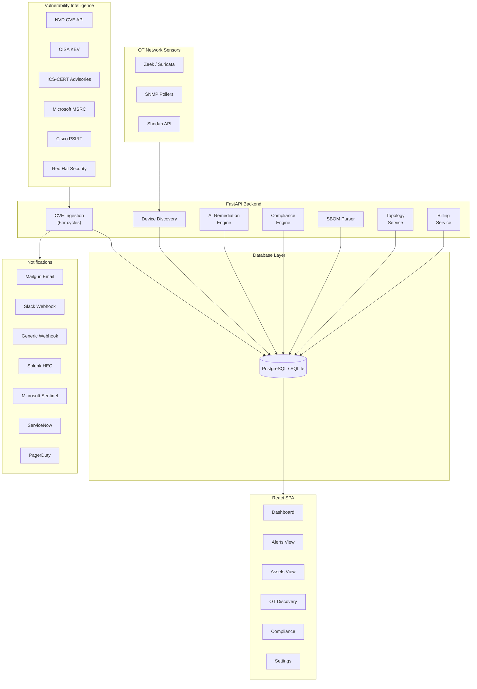

# OneAlert Architecture

## System Overview



## Request Flow

```
Client Request
    → CORS Middleware
    → SlowAPI Rate Limiter
    → Security Headers Middleware
    → Request ID Middleware
    → Metrics Middleware
    → FastAPI Router
    → Auth Dependency (JWT verification)
    → Route Handler
    → SQLAlchemy Async Session
    → Database
    → Response (with envelope on errors)
```

## Database Schema (ERD)

```
┌──────────────┐     ┌──────────────────┐     ┌──────────────┐
│ Organization │1───*│      User        │1───*│    Asset      │
│──────────────│     │──────────────────│     │──────────────│
│ id           │     │ id               │     │ id           │
│ name         │     │ email            │     │ name         │
│ slug         │     │ hashed_password  │     │ asset_type   │
│ plan         │     │ role             │     │ vendor       │
│ max_assets   │     │ org_id (FK)      │     │ product      │
│ max_users    │     │ mfa_enabled      │     │ is_ot_asset  │
└──────────────┘     │ github_id        │     │ network_zone │
                     └──────────────────┘     │ primary_protocol│
                            │1                │ criticality  │
                            │                 │ user_id (FK) │
                            │*                └──────┬───────┘
                     ┌──────────────┐               │1
                     │  AuditLog    │               │
                     │──────────────│               │*
                     │ user_id (FK) │        ┌──────────────┐
                     │ action       │        │    Alert      │
                     │ target_type  │        │──────────────│
                     │ detail       │        │ cve_id       │
                     └──────────────┘        │ severity     │
                                             │ cvss_score   │
                                             │ status       │
                                             │ user_id (FK) │
                                             │ asset_id (FK)│
                                             └──────┬───────┘
                                                    │1
                                                    │*
                                             ┌──────────────────┐
                                             │RemediationAction │
                                             │──────────────────│
                                             │ action_type      │
                                             │ description      │
                                             │ priority         │
                                             │ ai_confidence    │
                                             │ alert_id (FK)    │
                                             └──────────────────┘

┌────────────────────┐     ┌──────────────────┐
│ComplianceFramework │1───*│ComplianceControl │1───*┌────────────────────┐
│────────────────────│     │──────────────────│     │ComplianceAssessment│
│ name (IEC/NIST)    │     │ control_id       │     │────────────────────│
│ version            │     │ title            │     │ status             │
└────────────────────┘     │ framework_id(FK) │     │ evidence_type      │
                           └──────────────────┘     │ evidence_detail    │
                                                    │ user_id (FK)       │
                                                    │ control_id (FK)    │
                                                    └────────────────────┘

┌──────────────┐     ┌──────────────────┐
│     SBOM     │1───*│  SBOMComponent   │
│──────────────│     │──────────────────│
│ format       │     │ name             │
│ asset_id(FK) │     │ version          │
│ user_id (FK) │     │ purl             │
└──────────────┘     │ cpe              │
                     │ license          │
                     └──────────────────┘

┌───────────────────┐     ┌────────────────┐
│ NetworkConnection │     │DiscoveredDevice│
│───────────────────│     │────────────────│
│ source_asset_id   │     │ ip_address     │
│ target_asset_id   │     │ mac_address    │
│ protocol          │     │ hostname       │
│ user_id (FK)      │     │ protocols      │
└───────────────────┘     │ user_id (FK)   │
                          └────────────────┘

┌───────────────────┐     ┌──────────────┐
│IntegrationConfig  │     │ Subscription │
│───────────────────│     │──────────────│
│ provider (splunk/ │     │ org_id (FK)  │
│  sentinel/snow/pd)│     │ plan         │
│ config_json       │     │ stripe_id    │
│ user_id (FK)      │     │ status       │
└───────────────────┘     └──────────────┘
```

## Remediation Engine Rules

```
Input: Alert + Asset context
    │
    ├─ Rule 1: Has patch + NOT critical OT zone → "Apply vendor patch"
    ├─ Rule 2: Has patch + IS critical OT zone → "Network segmentation first,
    │          then schedule patch during maintenance window"
    ├─ Rule 3: CISA KEV + critical/high severity → "Immediately isolate" (top priority)
    ├─ Rule 4: Unencrypted protocol (Modbus/DNP3/BACnet) → "Deploy VPN overlay"
    └─ Rule 5: Always → "Accept risk" (lowest priority fallback)
```

## Compliance Mapping

```
Platform Data              →  Framework Control
─────────────────────────     ────────────────────
Asset inventory exists     →  IEC 62443 FR1-SR1.1, NIST CSF ID.AM-1
Network zones assigned     →  IEC 62443 FR5-SR5.1, NIST CSF PR.AC-5
Alerts acknowledged        →  NIST CSF RS.AN-1
Network sensors active     →  NIST CSF DE.CM-1
```

## Scheduler Jobs

| Job | Frequency | What It Does |
|-----|-----------|-------------|
| Vulnerability check | Every 6hrs | Fetches CVEs + advisories, matches assets, creates alerts |
| OT risk rescore | Every 12hrs | Recalculates risk scores for all OT assets |
| Daily cleanup | 2 AM UTC | Clears processed CVE/advisory tracking sets |
| Weekly stats | Sunday 3 AM UTC | Generates weekly statistics (stub) |
